## US1
As a Habitat Operator, I want to view all active sensors and their latest readings on a unified dashboard, so that I can monitor the overall habitat environment at a glance.

## US2
As a Habitat Operator, I want the sensor data on my dashboard to update automatically in real-time, so that I always have the most current telemetry without needing to refresh the page.

## US3
As a Habitat Operator, I want to see specific measurement units (e.g., C, kW, L/min) displayed alongside sensor values, so that I can interpret the data correctly.
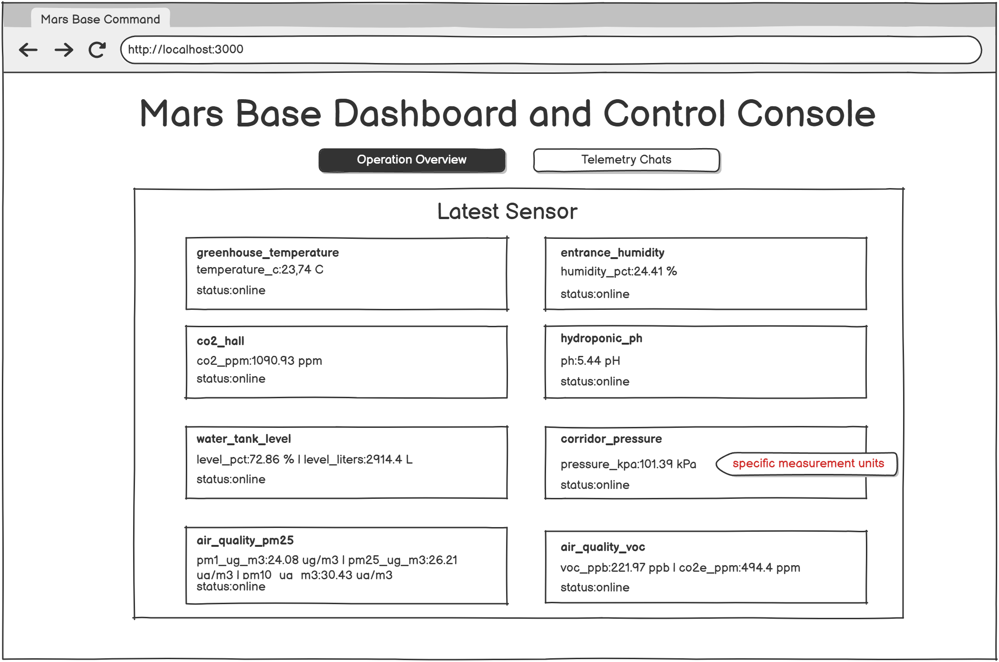
## US4
As a Habitat Operator, I want data from both slow-polling sensors and high-speed telemetry streams to be displayed in the same consistent format, so that I don't have to use different tools for different devices.

## US5
As a Habitat Operator, I want new sensors to be automatically discovered and integrated into my monitoring view, so that I don't have to manually configure the system every time a new device is wired up.
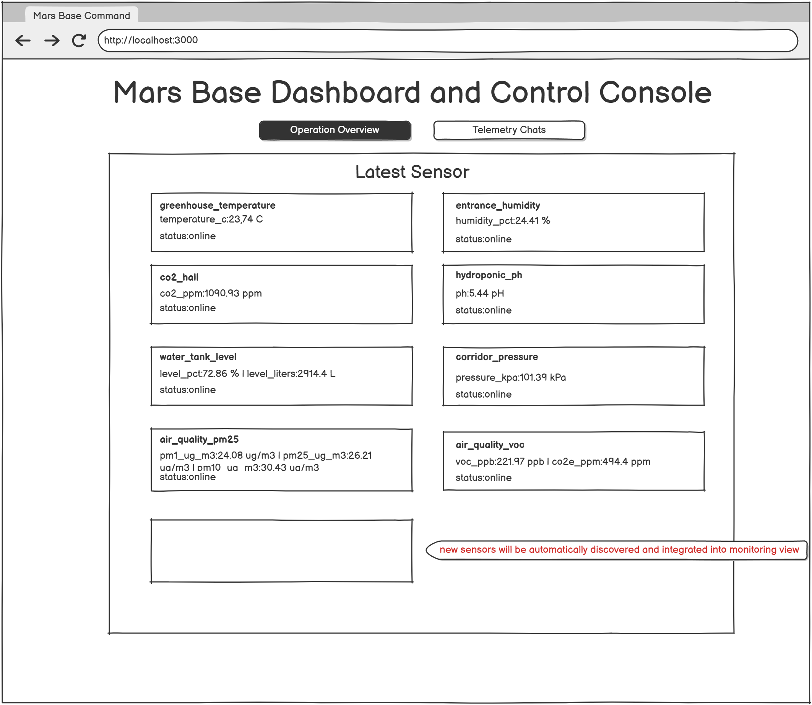
## US6
As a Habitat Operator, I want to clearly see the current operational state (ON/OFF) of all habitat actuators (e.g., cooling fans, heaters), so that I know exactly what life-support equipment is currently running.

## US7
As a Habitat Operator, I want to manually toggle the state of any actuator directly from the dashboard, so that I can immediately intervene and override the system during an emergency.
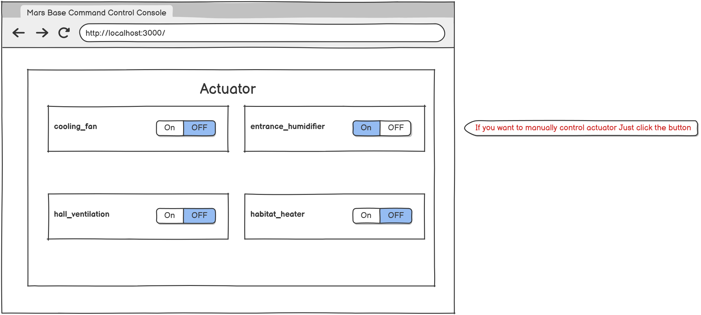
## US8
As a Habitat Operator, I want my manual actuator changes to be instantly reflected on the UI, so that I have immediate visual feedback that my command was executed.

## US9
As a Habitat Operator, I want the system to automatically turn actuators ON or OFF based on environmental data, so that the habitat remains safe even while I am sleeping.
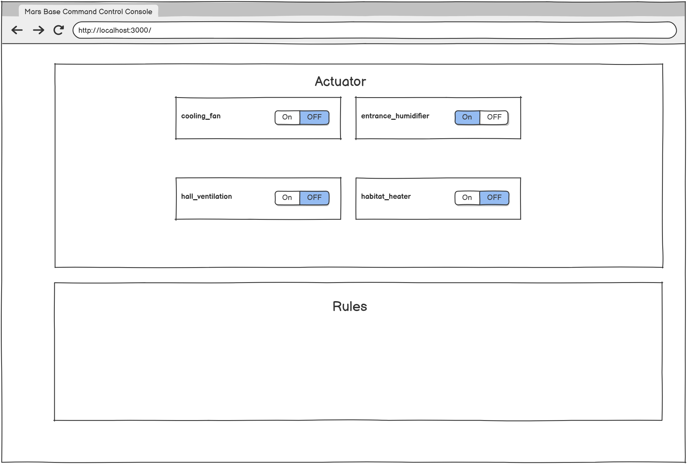
## US10
As a Habitat Operator, I want to create new automation rules through a visual interface on the dashboard, so that I can quickly instruct the system how to react to new environmental threats.
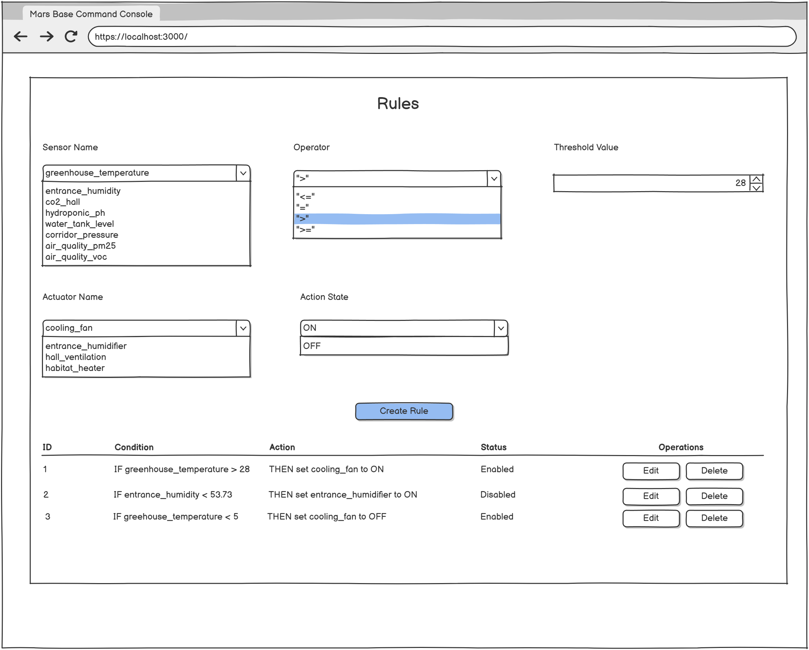
## US11
As a Habitat Operator, I want to configure rule conditions using standard mathematical comparisons (<, <=, =, >, >=), so that I can set precise safety thresholds (e.g., trigger fan if temp > 28C).
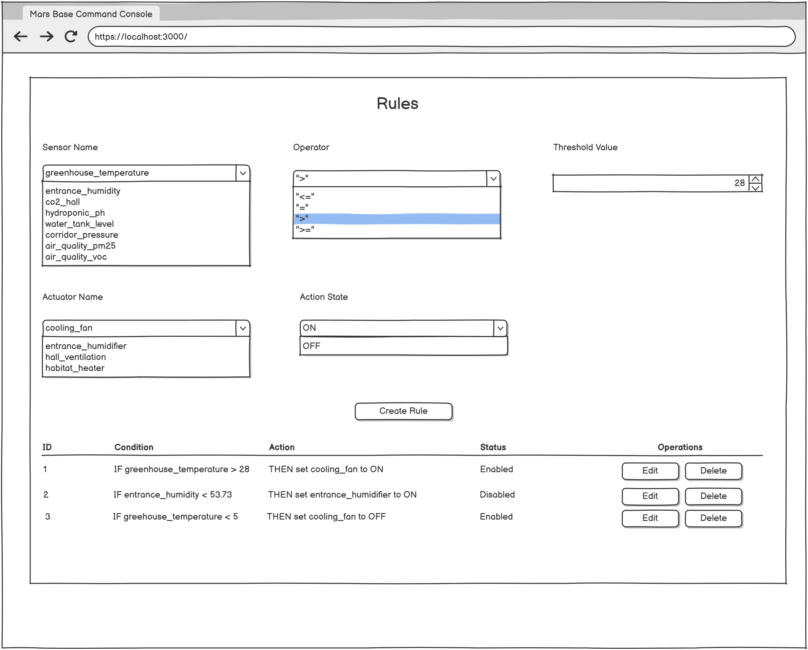
## US12
As a Habitat Operator, I want to view a list of all currently active automation rules, so that I know exactly how the system is programmed to behave.
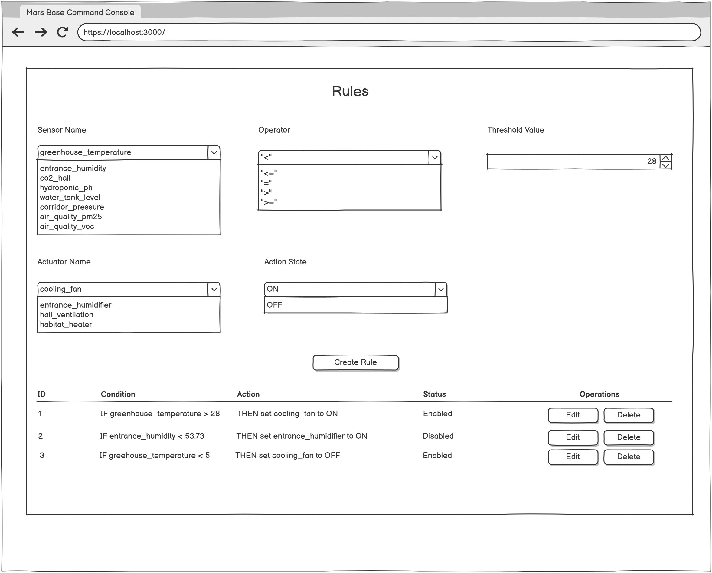
## US13
As a Habitat Operator, I want to edit existing automation rules, so that I can adjust safety thresholds as the mission parameters or seasons change.
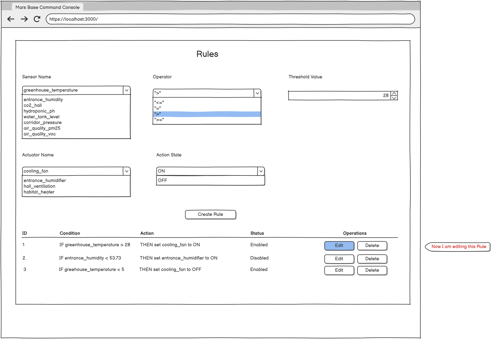
## US14
As a Habitat Operator, I want to delete obsolete automation rules, so that they don't trigger unwanted or conflicting system behaviors.
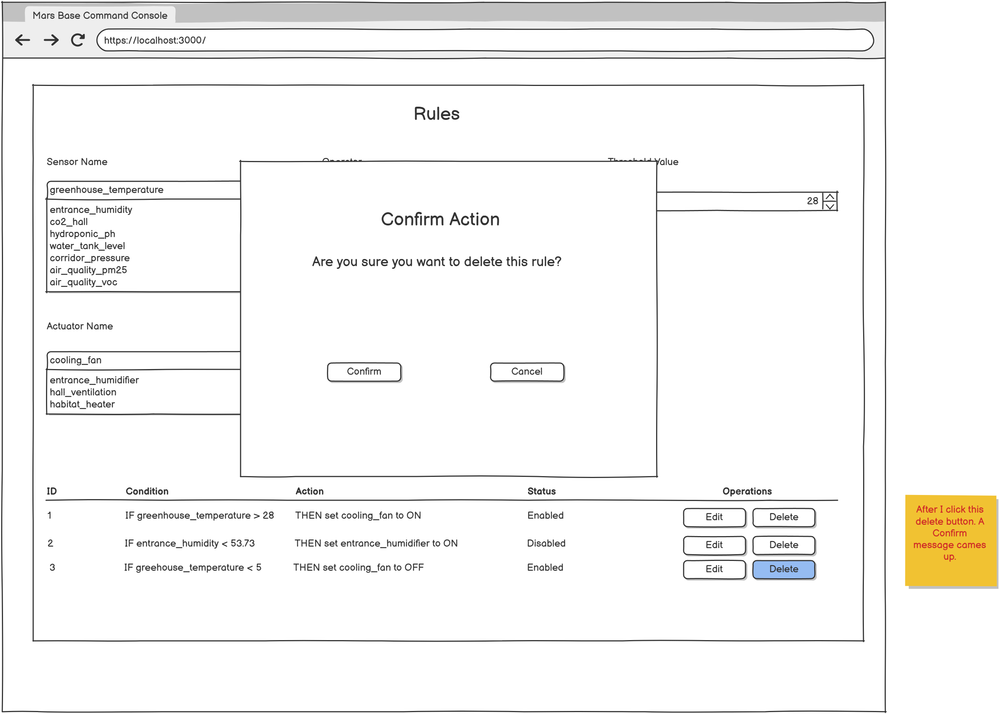
## US15
As a Habitat Operator, I want the automation service to log every time an automation rule automatically triggers an actuator to the console output, so that I can trace the system's autonomous decisions via container logs.
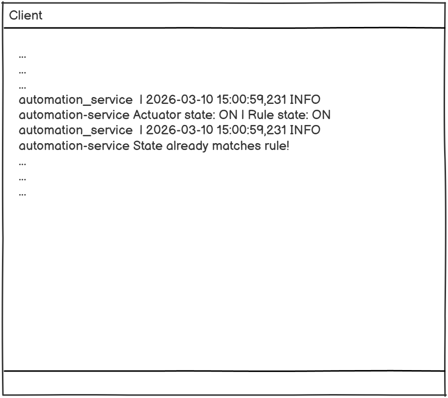
## US16
As a Platform Administrator, I want to deploy the entire habitat automation platform using a single startup command (docker compose up), so that recovery time is minimized during critical system failures.
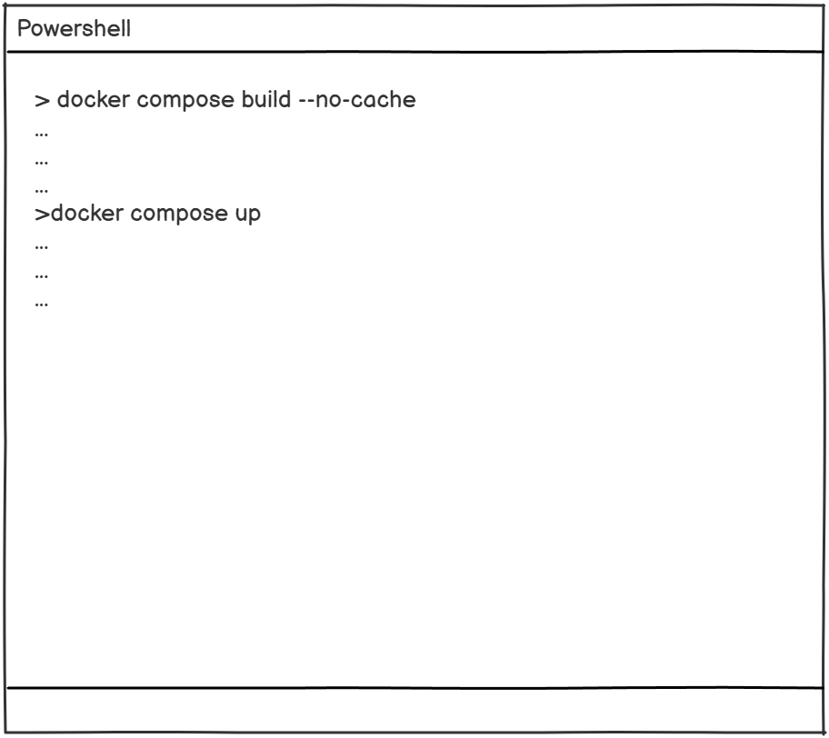
## US17
As a Platform Administrator, I want the system's internal communication to use a resilient message broker, so that sudden spikes in sensor data do not overwhelm the processing engines.
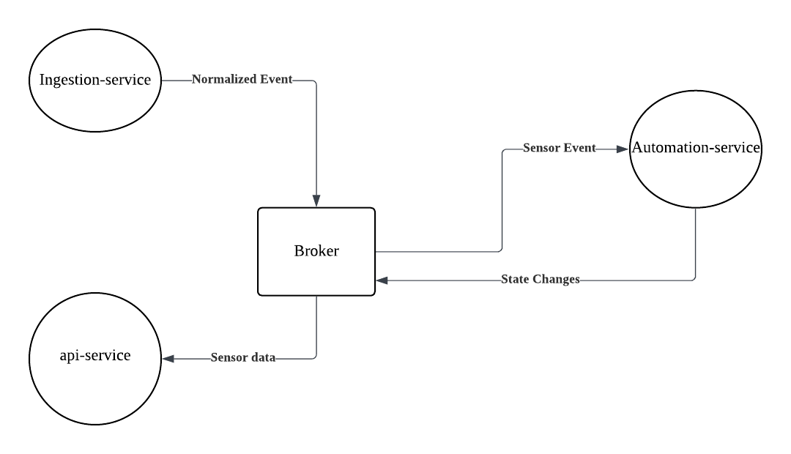
## US18
As a Platform Administrator, I want the data ingestion, rule evaluation, and web interface to run as separate isolated microservices, so that a crash in the web UI does not stop the background automation engine from keeping the crew alive.
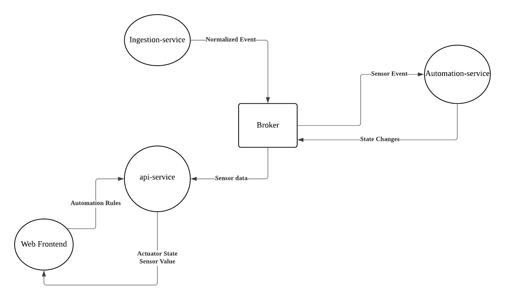
## US19
As a Platform Administrator, I want all defined automation rules to be saved to a persistent database, so that critical safety logic is immediately restored without manual data entry after a system reboot.

## US20
As a Platform Administrator, I want the platform to automatically normalize all heterogeneous device payloads into a single standard event format internally, so that future developers can add new features without worrying about device-specific dialects.
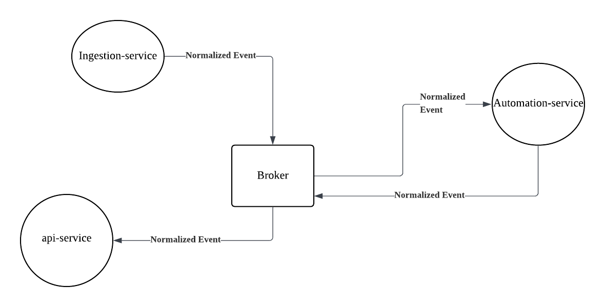